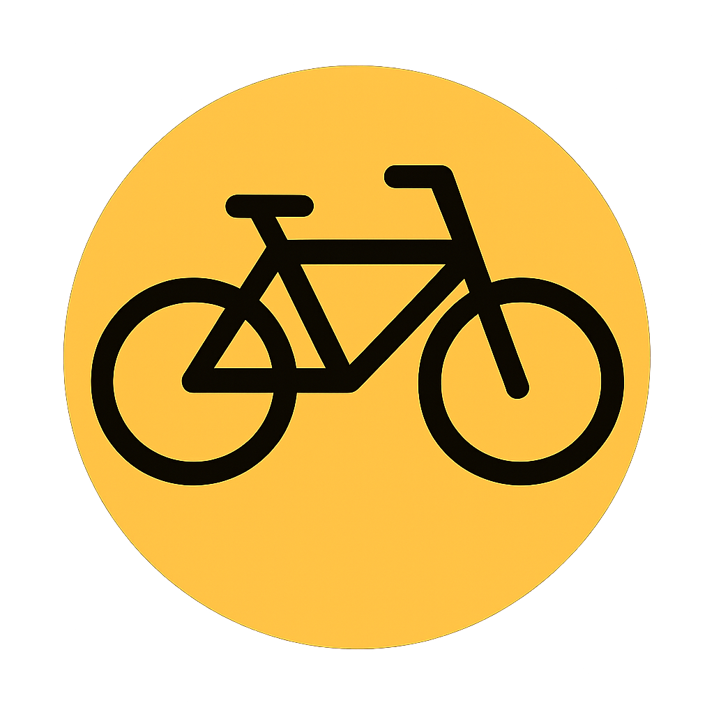

# LandingPage# BikeShare • Landing Page de Movilidad Colaborativa



Bienvenido al repositorio de la landing page para **BikeShare**, un proyecto conceptual de una plataforma de alquiler de bicicletas entre personas (peer-to-peer). Esta página ha sido diseñada para ser moderna, atractiva y completamente responsiva, con el objetivo de presentar la misión, visión y funcionalidades clave del servicio.

---

##  Descripción del Proyecto

**BikeShare** es una plataforma que conecta a dueños de bicicletas con personas que necesitan un medio de transporte flexible, económico y sostenible en la ciudad. Esta landing page sirve como el principal punto de entrada para nuevos usuarios, explicando de manera clara cómo funciona el servicio tanto para arrendatarios como para arrendadores, presentando al equipo detrás del proyecto y ofreciendo una vía de contacto directo.

El proyecto está construido desde cero utilizando únicamente **HTML, CSS y JavaScript**, demostrando el poder de las tecnologías web fundamentales para crear experiencias de usuario ricas e interactivas.

---

##  Características Principales

La página cuenta con una variedad de funcionalidades implementadas para mejorar la experiencia del usuario:

* **Diseño Totalmente Responsivo:** La interfaz se adapta fluidamente a cualquier tamaño de pantalla, desde teléfonos móviles y tabletas hasta monitores de escritorio.
* **Sistema de Traducción Bilingüe (ES/EN):**
    * Los usuarios pueden cambiar el idioma de todo el contenido de la página entre español e inglés con un solo clic.
    * La preferencia de idioma se guarda en el `localStorage` del navegador para futuras visitas.
* **Carrusel de Testimonios:**
    * Una sección de reseñas dinámica y automática que muestra las opiniones de la comunidad.
    * Incluye controles manuales (anterior/siguiente) y puntos de navegación.
* **Componentes Interactivos:**
    * Menú de navegación tipo "hamburguesa" en dispositivos móviles para un acceso compacto y funcional.
    * Efectos `hover` en botones y tarjetas para una retroalimentación visual clara.
    * Formulario de contacto funcional listo para ser integrado con un backend.
* **Código Limpio y Semántico:**
    * Uso de etiquetas semánticas de HTML5 (`<header>`, `<main>`, `<section>`, `<footer>`) para una mejor estructura y SEO.
    * Atributos de accesibilidad (`aria-label`, `role`, etc.) para mejorar la usabilidad para todos los usuarios.
* **Arquitectura CSS Moderna:**
    * Organización del estilo mediante CSS Grid y Flexbox.
    * Uso de variables CSS (Custom Properties) para un temizado fácil y consistente.

---

##  Tecnologías Utilizadas

* **HTML:** Para la estructura y el contenido semántico.
* **CSS:** Para el diseño, la maquetación responsiva y las animaciones.
* **JavaScript :** Para toda la lógica interactiva.
* **Google Fonts:** Para la tipografía personalizada.
* **Font Awesome:** Para la librería de iconos vectoriales.

---

##  Estructura del Proyecto

El repositorio está organizado de la siguiente manera para facilitar su mantenimiento y escalabilidad:

```
/
├── index.html         # Archivo principal de la página
├── styles.css         # Hoja de estilos principal
├── script.js          # Lógica y funcionalidad de la página
├── README.md          # La documentación que estás leyendo
└── img/               # Carpeta para todas las imágenes
    ├── principal-logo.png
    ├── icon-tab.png
    └── team/
        ├── rodrigo_alaya.jpeg
        ├── niurka_huarcaya.jpeg
        ├── jose_martinez.jpg
        ├── maria_mostajo.jpeg
        └── karen_ramos.jpeg
```

---

## 👥 Equipo (RepoRangers)

Este proyecto fue desarrollado por:

* **Rodrigo Alaya**
* **Niurka Huarcaya**
* **José Martinez**
* **Maria Mostajo**
* **Karen Ramos**
